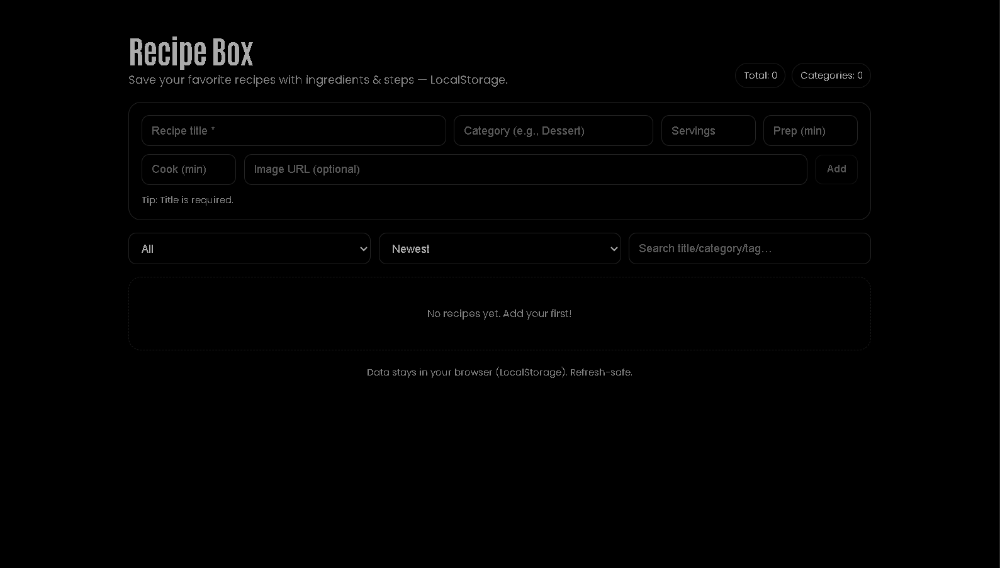

# Recipe Box (React + styled-components)



**Live Demo:** https://a2rp.github.io/recipe-box/

A lightweight, frontend-only Recipe Box to save your favorite recipes with **ingredients** and **steps**. Dark-theme friendly and fully **LocalStorage** powered.

## Features

-   Add recipes: **title**, category, servings, **prep/cook minutes**, image URL
-   Edit details + **duplicate**, **delete**
-   **Ingredients** (add/remove) and **Steps** (ordered, add/remove)
-   Optional **tags** (comma-separated)
-   **Search** (title/category/tag), **Filter** (category), **Sort** (Newest, Title, Category)
-   Responsive **flex** layout (auto-wrap)
-   Image fallback via `public/noRecipe.png`
-   Confirm modal for destructive actions
-   Data persists in **LocalStorage** (refresh-safe)

## Local Install

```bash
git clone https://github.com/a2rp/recipe-box.git
cd recipe-box
npm i
npm run dev
```
