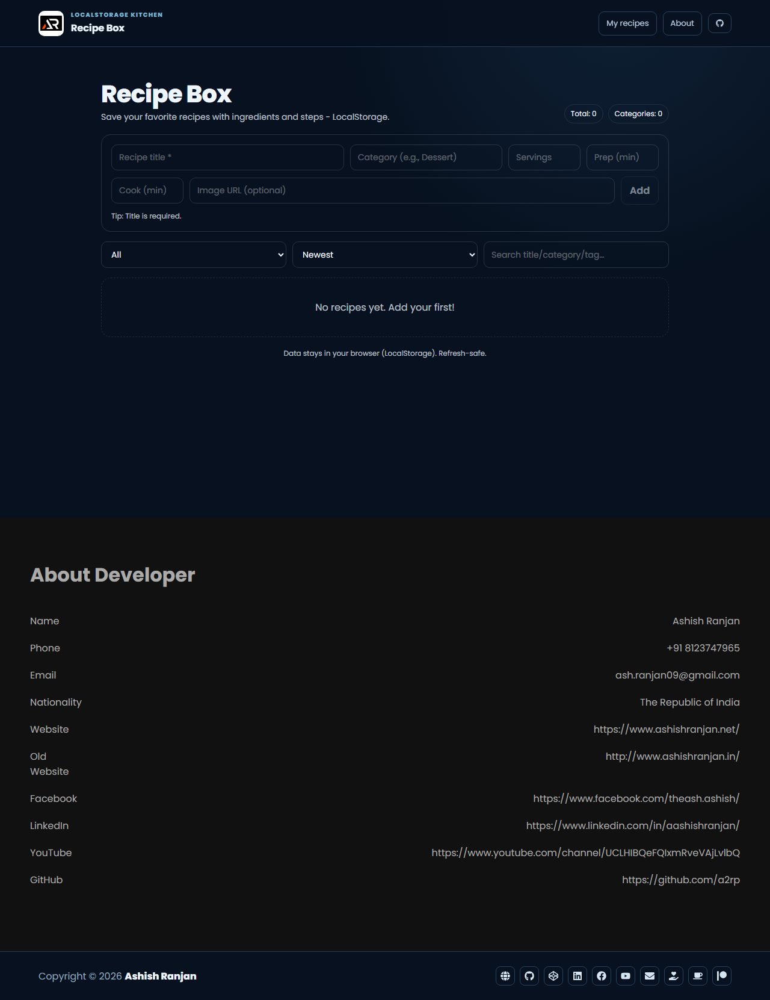

# Recipe Box

A dark, responsive React Recipe Box for saving recipes, ingredients, steps, tags, and cooking details in browser LocalStorage.



## Features

- Add, edit, duplicate, and delete recipes.
- Store ingredients, ordered steps, notes, tags, servings, and cooking times.
- Search by title, category, or tag.
- Filter by category and sort by newest, title, or category.
- Image fallback, confirmation modal, responsive layout, and refresh-safe LocalStorage.
- Fixed branded header, floating go-to-top button, and icon-only footer links.

## Tech stack

React, Vite, styled-components, CSS, LocalStorage, and React Icons.

## Run locally

```bash
npm install
npm run dev
```

Build with `npm run build` and deploy with `npm run deploy`.

## Live

[Open the live project](https://a2rp.github.io/recipe-box/)

## Links

- Portfolio: [https://www.ashishranjan.net](https://www.ashishranjan.net)
- GitHub: [https://github.com/a2rp](https://github.com/a2rp)
- CodePen: [https://codepen.io/ash1198](https://codepen.io/ash1198)
- LinkedIn: [https://www.linkedin.com/in/aashishranjan](https://www.linkedin.com/in/aashishranjan)
- Facebook: [https://www.facebook.com/theash.ashish/](https://www.facebook.com/theash.ashish/)
- YouTube: [https://www.youtube.com/@ashishranjan-ashz?sub_confirmation=1](https://www.youtube.com/@ashishranjan-ashz?sub_confirmation=1)
- Email: [ash.ranjan09@gmail.com](mailto:ash.ranjan09@gmail.com)

## Support

- Support: [https://a2rp-donation-page.netlify.app/](https://a2rp-donation-page.netlify.app/)
- Buy Me a Coffee: [https://buymeacoffee.com/a2rp](https://buymeacoffee.com/a2rp)
- Patreon: [https://patreon.com/a2rp](https://patreon.com/a2rp)
