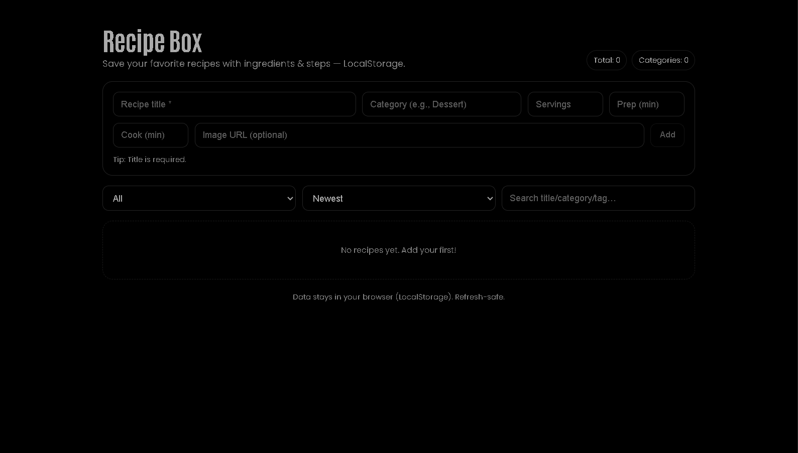

# Recipe Box (React + styled-components)



**Live Demo:** https://a2rp.github.io/recipe-box/

A lightweight, frontend-only Recipe Box to save your favorite recipes with **ingredients** and **steps**. Dark-theme friendly and fully **LocalStorage** powered.

## Features

-   Add recipes: **title**, category, servings, **prep/cook minutes**, image URL
-   Edit details + **duplicate**, **delete**
-   **Ingredients** (add/remove) and **Steps** (ordered, add/remove)
-   Optional **tags** (comma-separated)
-   **Search** (title/category/tag), **Filter** (category), **Sort** (Newest, Title, Category)
-   Responsive **flex** layout (auto-wrap)
-   Image fallback via `public/noRecipe.png`
-   Confirm modal for destructive actions
-   Data persists in **LocalStorage** (refresh-safe)

## Local Install

```bash
git clone https://github.com/a2rp/recipe-box.git
cd recipe-box
npm i
npm run dev
```

## Links

- Portfolio: [https://www.ashishranjan.net](https://www.ashishranjan.net)
- GitHub: [https://github.com/a2rp](https://github.com/a2rp)
- CodePen: [https://codepen.io/ash1198](https://codepen.io/ash1198)
- LinkedIn: [https://www.linkedin.com/in/aashishranjan](https://www.linkedin.com/in/aashishranjan)
- Facebook: [https://www.facebook.com/theash.ashish/](https://www.facebook.com/theash.ashish/)
- YouTube: [https://www.youtube.com/@ashishranjan-ashz?sub_confirmation=1](https://www.youtube.com/@ashishranjan-ashz?sub_confirmation=1)
- Email: [ash.ranjan09@gmail.com](mailto:ash.ranjan09@gmail.com)

## Support

- Support: [https://a2rp-donation-page.netlify.app/](https://a2rp-donation-page.netlify.app/)
- Buy Me A Coffee: [https://buymeacoffee.com/a2rp](https://buymeacoffee.com/a2rp)
- Patreon: [https://patreon.com/a2rp](https://patreon.com/a2rp)
<!-- Project links -->

## Links

- Live: [https://a2rp.github.io/recipe-box/](https://a2rp.github.io/recipe-box/)
- Repository: [https://github.com/a2rp/recipe-box](https://github.com/a2rp/recipe-box)
- Portfolio: [https://www.ashishranjan.net/](https://www.ashishranjan.net/)
- GitHub: [https://github.com/a2rp](https://github.com/a2rp)
- CodePen: [https://codepen.io/ash1198](https://codepen.io/ash1198)
- LinkedIn: [https://www.linkedin.com/in/aashishranjan](https://www.linkedin.com/in/aashishranjan)
- Facebook: [https://www.facebook.com/theash.ashish/](https://www.facebook.com/theash.ashish/)
- YouTube: [https://www.youtube.com/@ashishranjan-ashz?sub_confirmation=1](https://www.youtube.com/@ashishranjan-ashz?sub_confirmation=1)
- Email: [ash.ranjan09@gmail.com](mailto:ash.ranjan09@gmail.com)

## Support

- Support: [https://a2rp-donation-page.netlify.app/](https://a2rp-donation-page.netlify.app/)
- Buy Me a Coffee: [https://buymeacoffee.com/a2rp](https://buymeacoffee.com/a2rp)
- Patreon: [https://www.patreon.com/a2rp](https://www.patreon.com/a2rp)
